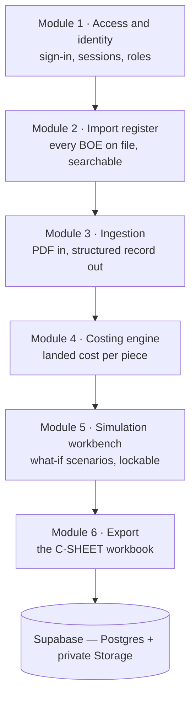
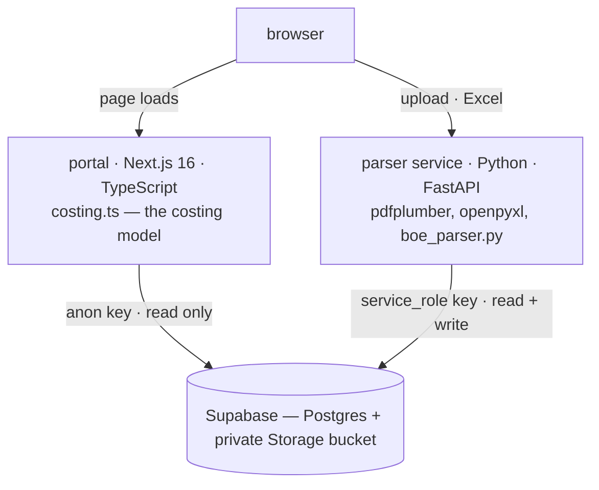

# BOE Costing Portal — Technical Overview

The BOE Costing Portal turns an ICEGATE Bill of Entry into a structured import
record, computes the landed cost of every line item on it, and lets that
costing be re-run under hypothetical inputs without disturbing the record it
came from.

It answers one question, repeatedly and exactly: **what did this item cost me,
landed, per piece?** The output is the C-SHEET workbook the business has
always costed against — what changes is that nobody transcribes figures into
it by hand, and the arithmetic behind it is pinned by tests.

This is the short form. [`docs/WHITEPAPER.md`](WHITEPAPER.md) is the full
technical document; [`docs/PARSER.md`](PARSER.md) is the field-by-field
extraction reference.

## Where it runs

| | |
| --- | --- |
| Portal | **https://boe-costing-portal.vercel.app** |
| Parser service | https://boe-costing-portal-backend.vercel.app |
| Database, auth, storage | Supabase (Postgres 17) |

Two Vercel projects from one repository, deployed separately because the
portal is Next.js and the parser is Python. Both point at the same Supabase
project. Sign-in is Google, restricted to addresses an administrator has
granted access to.

## The six modules



**1 · Access and identity.** The portal is entered through Supabase Auth.
Every page requires a session, and the database policies grant to
*authenticated* rather than to anyone, so access is decided at the data layer
and not by which screen the interface chooses to render. Three credentials are
deliberately unequal: the browser's anon key reads but never writes, the
parser service holds the `service_role` key server-side and is the only path
that can change a record, and administrative routes sit behind a token that
fails closed when unset. A session also gives the system a person
to attribute an action to, which is what makes scenario ownership and
per-scenario locking meaningful.

**2 · Import register.** Every Bill of Entry in one list, filtered by supplier,
BOE number, date range and value range, sortable on any column. Opening a
record shows its shipment facts, its costing table, its licence rows and its
indexed documents. Exchange rate and freight are routinely estimated at
costing time and settle weeks later, so each carries a status shown green when
confirmed and red while provisional — anything never confirmed counts as
provisional, because silence is not confirmation.

**3 · Ingestion.** A Bill of Entry is a fixed-layout government form, 7–30
pages, printed to PDF with no data layer. Every stored field is recovered from
the printed page: labelled values by text, and the dense duty and licence
grids by x-coordinate, which is the only thing that says which bare number is
which. Page furniture — the watermark, the sideways margin labels — is
filtered out by character size before words are assembled, because once it
fuses with a real token no text matching can separate it. Re-ingesting a
record replaces its items wholesale and refreshes any figure still marked
provisional, never one a person has confirmed.

**4 · Costing engine.** The model, below.

**5 · Simulation workbench.** Scenarios against one record, compared side by
side.

**6 · Export.** The C-SHEET workbook with live formulas, for the actual record
or for a scenario.

## Architecture



Two deployable services and one database. The portal is TypeScript and cannot
read a PDF; the extraction is positional, done with `pdfplumber` by
x-coordinate, which is what lets it survive watermark bleed, OCR spelling
variants and multi-invoice numbering. So one Python process exists, needed for
exactly two actions — PDF upload and Excel download. Everything else is
Postgres reads plus arithmetic in the browser.

They deploy as separate Vercel projects because a Next.js app and a Python
function both claim `/api/*`, and inside one project Next answers first.
`costing.ts` is the single implementation of the costing model: pure, with no
Supabase, no React and no clock, so it is fully unit-testable. The simulation
export does not redo the arithmetic — the portal posts the result it is
already displaying and the parser lays it into the template, because two
implementations of one model would eventually disagree.

## The costing model

Landed cost is value-proportional apportionment of a single expense pool. For
each item *i*:

```
declared INR     Fi  =  unit_price_usd  x  qty  x  exchange_rate
value share      si  =  Fi / SUM(F)
expense share    Hi  =  expense_pool  x  si
duty in cost     Gi  =  BCD + SWS
cost per piece   Ii  =  (Fi + Gi + Hi) / qty
```

Change any expense and every item's slice moves in proportion; change a price
and the shares are recomputed before the split. The pool covers freight,
insurance, clearance, misc charges, supplier freight, bank charges, own bank
charges and others — all eight apportioned.

**IGST is excluded from cost.** It is a creditable input tax, so it is cash
flow rather than cost; it is reported separately.

**Duty is recorded as amounts, never rates**, so effective rates are
back-computed from what customs actually charged. An item's BCD may be paid in
cash or met by debiting an export-incentive licence, and the form records
those in different places — on a fully licence-paid Bill of Entry, page 1
shows BCD 0 while SWS is 10% of a BCD never paid in cash, and Section G is the
only source of the real figure.

## Simulation

Every adjustable input on a scenario is nullable, and null means *inherit the
actual*. A new scenario reproduces the actual costing exactly until something
is deliberately changed, so any difference on screen is a difference the user
made — which is what makes a scenario diffable against the record rather than
a disconnected copy.

| | |
| --- | --- |
| **Duty mode** | fixed at what customs charged, or floating with value |
| **Freight** | a typed total, or rate × weight, volume or containers |
| **Per item** | price and quantity overrides; FOC; duplicated rows |
| **Comparison** | every scenario costed live in the browser, against the actual |

**FOC items** keep their declared value in the apportionment base — the goods
still ship and are still assessed, so removing their value would shift freight
onto the paid items. **Duplicated items** always derive duty from their
source's rates even when duty is fixed, because locking a copy to the source's
actual amounts would charge the same customs payment twice.

**A scenario may carry a password.** Once set and saved, opening it requires
that password; without it the scenario is listed by name and nothing more.
Enforcement is at the data layer, not in the interface: the portal reads
scenario tables directly from Postgres, so a lock that only hides a panel is a
curtain rather than a lock. The password is stored as a hash that is never
selectable, verification returns a short-lived grant, and the row-level policy
releases the scenario body only against it. The lock is on the scenario and
never on the record, because the value of a scenario is being diffable against
a costing that stays readable.

## Verification

Three independent checks, each catching a different class of error.

**The document reconciles against itself.** The form states its own assessable
value; the parser computes one independently as
`inv_value × exchange_rate + freight + insurance + misc`. The two agree to the
paisa on a correct parse — BE 3168452 computes 4,204,710.42 against a stated
4,204,710.41, and BE 2898472 is exact — and a gap means an input is in the
wrong unit. It is the single most useful diagnostic in the system.

**Screen and workbook agree.** The C-SHEET formulas are evaluated by hand in
the test suite and checked against the engine, because both are shown to the
same user from the same page.

**Invariants hold.** Switching duty mode with nothing else changed moves no
number, and a new scenario reproduces the actual costing exactly. Both are
tests rather than conventions.
