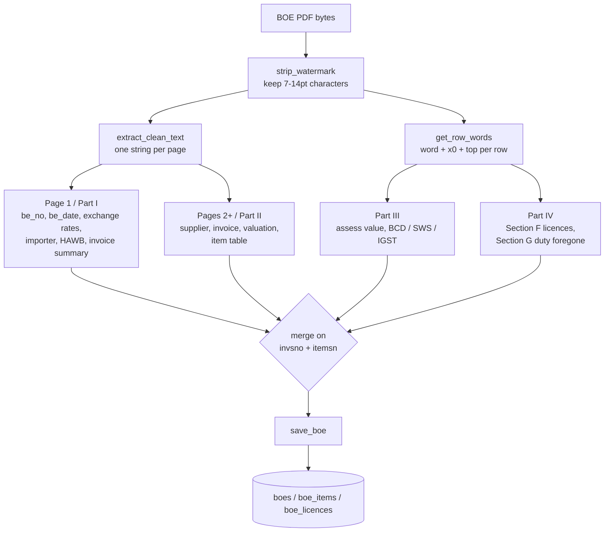
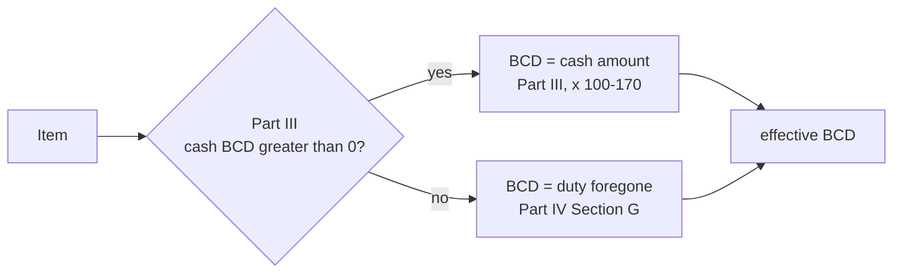

# How the BOE parser reads a Bill of Entry

Reference for `backend/boe_parser.py`. Every field the portal stores, where on
the form it comes from, how it is extracted, and the circumstances that change
the answer.

An ICEGATE Bill of Entry is a fixed-layout government form, typically 7–30
pages, printed to PDF. It has no data layer — no XML, no embedded metadata.
Everything below is recovered from the printed page.

---

## 1. Two ways to read the page, and why both exist

`pdfplumber` offers two views of a page, and this parser uses both,
deliberately, for different parts of the form.

|            | **Text extraction**                        | **Positional extraction**                     |
| ---------- | ------------------------------------------ | --------------------------------------------- |
| Call       | `page.extract_text()`                      | `page.extract_words()` → `get_row_words()`    |
| Gives you  | one string, in reading order               | every word with its `x0` and `top`            |
| Used for   | Part I and Part II — header, invoice, items | Part III and Part IV — duty, assess value, licences |
| Why        | values sit next to a printed label          | values sit in **unlabelled columns**          |

The dividing line is not arbitrary. Parts I and II print a label beside each
value (`1.IMPORTER NAME & ADDRESS`, `14.Cur`), so a regex anchored on the label
finds it. Parts III and IV are dense grids where one row carries BCD, SWS and
IGST as bare numbers, under column headers printed once, pages earlier.
Reading order there is unreliable and labels are absent — the x-coordinate is
the only thing that says which number is which.

### `get_row_words()` — the shared primitive

```python
words = strip_watermark(page).extract_words()
rows[round(w['top'], 1)].append((w['x0'], w['text']))
```

Words are bucketed into rows by vertical position, rounded to **one decimal
place**. Whole-point rounding was tried and abandoned: in a dense licence table
consecutive rows can be pitched under 1pt apart, so two different rows collapse
into one bucket and whichever is read second silently overwrites the first — a
licence row vanishing with no error.

`min_x` drops the left margin. It defaults to 60, and is set to 0 by the
parsers that need the invoice and item-number columns at x ≈ 70–135.

---

## 2. Removing the page furniture first

The form sets all of its content between **7pt and 14pt**. Two things outside
that band land in the text layer anyway:

| Bleed                                      | Size       | Where it lands                    |
| ------------------------------------------ | ---------- | --------------------------------- |
| Diagonal `ASSESSED COPY` watermark          | ~51–57pt   | anywhere, including mid-word      |
| Section labels printed sideways down margins | 2.2–6.9pt | single stacked characters         |

Both **fuse with real tokens**, which is what makes them dangerous. Observed on
real BOEs: `Charger 5A` read as `Charger 5AE`; `Remote` as `RemoSte`; a licence
number as `2607E000174`; `Type-C Cable` trailed by `T E.E D M`. Once fused, no
text matching can separate them.

`strip_watermark()` keeps only characters inside the body band, **before** words
are assembled, so nothing downstream has to guess which letters are real:

```python
BODY_MIN_SIZE, BODY_MAX_SIZE = 7.0, 20.0
page.filter(lambda o: o.get('object_type') != 'char'
            or BODY_MIN_SIZE <= (o.get('size') or 0) <= BODY_MAX_SIZE)
```

Every text parser reads from `extract_clean_text()` — this filter plus
`extract_text()`. `get_row_words()` applies the same filter.

> **Historical note.** Before the size filter, margin bleed was swept up by
> deleting every lone capital from a description. That also deleted real ones:
> `Type C - Mic` became `Type - Mic`, and `Type-C Cable` became `Type-Cable`,
> collapsing the Type-C and 3.5mm variants of the same earphone into identical
> text. Filtering by size removes bleed at the source; the strip is gone.

---

## 3. Pipeline



Order matters in one place: `parse_all_items` needs the exchange rate from
Part I, because Part II's misc-charge figure is quoted in foreign currency and
is multiplied by it on the way in.

---

## 4. Field reference

### Part I — Bill of Entry summary (page 1)

| Field            | Printed as                        | How it is found |
| ---------------- | --------------------------------- | --------------- |
| `be_no`          | `INMAA4 3168452 15/08/2026 H`     | `parse_be_no_from_pages` scans **every** page for `BE No` followed by 6+ digits, with three fallback patterns. Scanning all pages is deliberate — the masthead repeats, so a damaged page 1 is survivable. |
| `be_date`        | same row                          | `parse_header` matches the **data row shape** `\b(\d{7})\s+(\d{2}/\d{2}/\d{4})\s+[A-Z]\b`, not the label. The `BE No` / `BE Date` labels print on a separate line from their values, so label-anchored matching never worked. |
| `exchange_rate`  | §H `1 USD=96.05INR`               | `1 USD=([\d.]+)INR` |
| rate table       | §H, one line per currency         | `parse_exchange_rates` collects every `1 XXX=nnn INR`, plus `INR: 1.0`. Needed because a BOE can quote invoice, freight and insurance in **different** currencies. |
| `importer_name`  | §B `1.IMPORTER NAME & ADDRESS`    | first line of the address block; a trailing lone capital is stripped as surviving bleed |
| `hawb_no`        | §D manifest details               | four patterns in order. The first handles the common case where a long HAWB **wraps**, printing its trailing digits on the next line *after* the date: `...AOFCTU902 02/08/2026` + `1` → `AOFCTU9021`. |
| invoice summary  | §I `2.INVOICE NO` table           | `parse_invoice_summary_multi` returns every invoice on the BOE with number, amount and currency; used as a fallback when Part II yields no invoice number |

### Part II — Invoice & valuation (pages 2+)

| Field                | Printed as                | How it is found |
| -------------------- | ------------------------- | --------------- |
| `supplier_name`      | §B                        | read from the line after **`4.THIRD PARTY NAME & ADDRESS`**, not `3.SUPPLIER NAME & ADDRESS`. In this form's reading order the supplier label lands in the rotated sidebar and its data block lands under the *next* label. The `3.SUPPLIER` pattern stays as a fallback for layouts without the quirk. |
| `inv_no`             | §A                        | invoice numbers are alphanumeric (`KZ20260710RAG`) and the leading serial varies by invoice, so both shapes are matched |
| `inv_date`           | §A                        | `(\d{2}-[A-Z]{3}-\d{2})` |
| `inv_value_usd`, `freight_inr`, `insurance_inr` | §C valuation row | `([\d.]+)\s+([\d.]+)\s+([\d.]+)\s+DP` — three numbers before the payment term. **They are not all in INR — see §5.3.** |
| `misc_charges_inr`   | §D `13.MISC CHARGE`       | the line after the `14.ASS. VALUE` label. Two numbers means `[misc, assess value]`; one means no misc charge. Quoted in foreign currency, so multiplied by the exchange rate. |
| item rows            | §E item table             | see below |

**The item table regex:**

```
^[A-Z\s]{0,3}(\d{1,2})\s+[\dOI]{7,9}\s+(.+?)\s+([\d]*\.[\d]{4,6})\s+([\d]*\.[\d]{4,6})\s+(?:PCS|SET|NOS|UNT)\s+([\d]*\.[\d]+)
   bleed        S.No       CTH          description      unit price          quantity            UQC                 amount
```

Four things this encodes, each from a real failure:

- `^[A-Z\s]{0,3}` tolerates up to three bleed characters prefixing the row.
- `[\dOI]{7,9}` — the CTH tariff code, where `0`/`O` and `1`/`I` are confusable.
- `[\d]*\.[\d]{4,6}` — the leading digit is **optional**. Values under 1 print
  without a leading zero (`.950000`); requiring one dropped the whole item, and
  its duty with it.
- The UQC alternation must list every unit in use. Missing `SET`, `NOS` or
  `UNT` silently dropped every item quoted in them, while `PCS` items on the
  same page parsed fine.

**Wrapped descriptions.** Only the first line carries price, quantity and UQC.
The continuation loop appends up to four following lines, stopping at the next
item's `S.No + CTH` line, a blank line, `GLOSSARY`, the invoice valuation
summary line, `Page N Of M`, or the ICETRAK footer. Without the last two, the
final item on each page absorbed the page footer.

### Part III — Duties (positional)

Anchor row: `(\d)\s+(\d{1,2})\s+\d{7,9}\s+NOEX(?:C|EC)ISE` — invoice serial,
item serial, CTH, then the excise marker. Both `NOEXCISE` and the typo variant
`NOEXECISE` appear on real forms.

| Field                  | Rule |
| ---------------------- | ---- |
| `bcd`, `sws`, `igst`   | from the anchor, scan **down to 120pt** for the first row whose first token is `Amount`, then read by x-window: **BCD 100–170**, **SWS 195–240**, **IGST 295–340**. A vertical-distance window is used rather than a row count because sidebar text injects junk rows that push the real row out of a fixed count. |
| `assess_value`         | `29.ASSESS VALUE` — the first row below the anchor carrying two numbers of 3+ digits, taking the second-to-last. **Rows containing a unit code are skipped:** an item declared `250 PCS 250 NOS` puts two 3-digit numbers on its *quantity* row, which otherwise wins and records the quantity as the assessable value. |

### Part IV — Additional details (positional)

| Field          | Section | Rule |
| -------------- | ------- | ---- |
| licences       | §F LICENCE DETAILS | anchor is invsno **x 70–90**, itemsn **x 105–135**, debit duty **x 505–575** on one row. Licence number read at **x 185–265**; if corrupted there, the row above is checked at x 150–265. Non-digits are stripped, and more than 10 digits keeps the last 10. If itemsn is missing while the rest anchors, nearby buckets within 4pt are searched — it can be displaced vertically from its own row. |
| `bcd_forgone`  | §G SCHEME NOTIFICATION AND DUTY FOREGONE | invsno **x 70–90**, itmsno **x 105–130**, scheme name **x 190–235** (uppercase, ≥3 chars), BCD AMT FG **x 440–505**. Matched by column *shape*, not scheme name, because the scheme varies (`RODTEP`, `ROSCTL`). **Confined to the Section G band** and tracked across pages — see §6.2. |

### Derived on save

| Column                 | Derivation |
| ---------------------- | ---------- |
| `total_assess_value`   | sum of all per-item assess values |
| `total_duty`           | sum of `bcd + sws + igst` across items |
| `boe_items.total_duty` | per item, same sum |

---

## 5. Circumstances that change the answer

### 5.1 Licence-paid vs cash BCD

The most consequential fork. An item's BCD may be paid in cash, or met by
debiting an export-incentive licence. The form records these in **different
places**:



`deriveDutyRates` in `costing.ts` implements exactly this: cash BCD when
positive, otherwise `bcd_forgone`. On a fully licence-paid BOE, page 1 shows
**BCD 0** while SWS and IGST are non-zero — SWS is 10% of a BCD that was never
paid in cash. Section G is then the only source of the real figure.

A cross-check that holds on real forms: Section G's per-item BCD-foregone
equals the sum of that item's Section F licence debits, and the total is
exactly 10× the SWS printed on page 1.

### 5.2 Multiple invoices on one BOE

Each invoice restarts its item numbering at 1. `group_pages_by_invoice` splits
Part II pages on their `(Invoice N M)` header and parses each block
independently, then assigns a running `global_sno` across all of them.

- `(invsno, itemsn)` is the natural key — it is what Part III and Part IV also
  key by, and what every join uses.
- `global_sno` is the document-wide sequence, used for Excel row placement.
- Header fields (supplier, invoice, freight) come from the invoice with the
  **most items**.

Concatenating pages into one blob instead causes item numbers to collide across
invoices and silently overwrite each other.

### 5.3 Freight and insurance currency

The three valuation figures are **not all INR**, and which ones are varies by
BOE. The row beneath them says so:

```
43091.68   636.82   4588      DP  Rule 4 - Transaction Value
14.Cur     USD      USD       INR
```

`parse_page2` reads that `14.Cur` row and converts each figure by **its own**
stated currency, using the rate table from Part I. `inv_value` keeps its
original currency (it lands in `inv_value_usd`); freight and insurance are
stored as INR columns, so they are converted.

An unrecognised currency is left untouched rather than multiplied by a guessed
rate — a figure obviously in the wrong unit is recoverable; one silently scaled
by the wrong rate is not.

> Read as INR regardless, a USD freight is understated by the whole exchange
> rate. On BE 3168452, USD 636.82 became 636.82 rupees — ₹60,530 missing from
> the expense pool of a ₹4.2M consignment, under-costing all 38 items.

### 5.4 Items with no assessable value

Scenario duty can only float with value if there is an assessable value to
back-compute a rate from. Where there is none, `costing.ts` holds that item at
its actual duty and flags it (`dutyFellBackToActual`), rather than multiplying
by a zero rate and reporting nil duty.

---

## 6. Failure modes

### 6.1 The reconciliation check

The form states its own assessable value at `14.ASS. VALUE`. Independently:

```
computed = inv_value × exchange_rate + freight + insurance + misc
```

The two agree to the paisa on a correct parse. A large gap means an input is in
the wrong unit. This is the single most useful diagnostic in the parser, and
the check that catches currency bugs immediately.

| BOE       | Computed      | Form          | Gap    |
| --------- | ------------- | ------------- | ------ |
| 3168452   | 4,204,710.42  | 4,204,710.41  | +0.01  |
| 2898472   | 616,041.60    | 616,041.60    | 0.00   |

### 6.2 Column shape is not unique to one section

Section G's shape — invsno, itmsno, an uppercase token, a number in the amount
column — is also matched by a **Part III item row**, where `NOEXCISE` stands in
for the scheme name and any number in the description lands in the amount
column. Scanning every page for that shape produced a BCD-foregone of `2.0`
from the `02` in *Silent Power 02 Power Modules*, on a BOE whose Section G is
empty.

The fix is a section band: from the `G. SCHEME NOTIFICATION AND DUTY FOREGONE`
header down to the next lettered section header (`^[A-Z]\.\s*[A-Z]`), tracked
across pages because a section that spills over does not repeat its header.

**General lesson: a positional rule needs a section gate, not just a column
shape.** The same applies to Part III's assess-value scan, which needed a
unit-code exclusion for the same class of reason.

### 6.3 A parser fix does not reach a BOE already stored

Parsing happens at upload. A stored record keeps whatever was read at the time
— re-upload it to pick up a fix. Re-uploading replaces items and licences
wholesale rather than duplicating them, so it is safe.

That was not sufficient on its own. `boe_variable_fields.freight_charges`
shadows `boes.freight_inr` in `resolveActualInputs`, and `save_boe()` did not
touch it, so a corrected parse stayed overridden by the stale figure.
`save_boe()` now calls `refresh_provisional_fields()`, which brings any field
still marked *provisional* in line with the new parse and logs the change to
`boe_field_history`. Fields marked *fixed* have been confirmed by a person and
are never overwritten.

---

## 7. Adding support for a new BOE layout

1. Drop the PDF in `samples/` — gitignored, because Bills of Entry are
   commercial records carrying IEC, GSTIN, supplier and unit prices.
2. Dump what the parser sees: `bp.extract_clean_text(page)` for the text lanes,
   `bp.get_row_words(page, min_x=0)` for the positional ones.
3. For a positional field, print `(x0, text)` for the row and read the column
   window off the real coordinates. Do not guess them.
4. Check character sizes before blaming the regex. If a token looks fused, it
   is bleed, and the size band is the fix.
5. Verify against the form's own totals. Page 1 states BCD, SWS, IGST, total
   duty and total assessable value — all five must reconcile.
