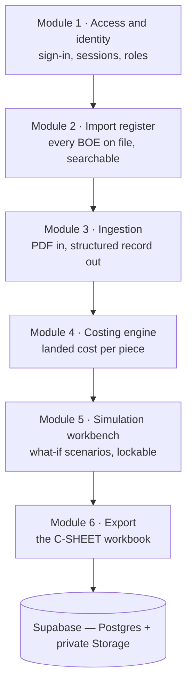
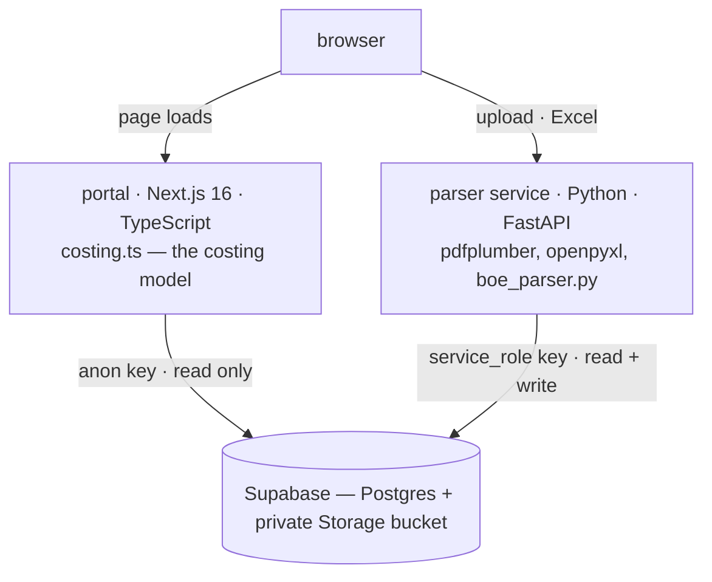
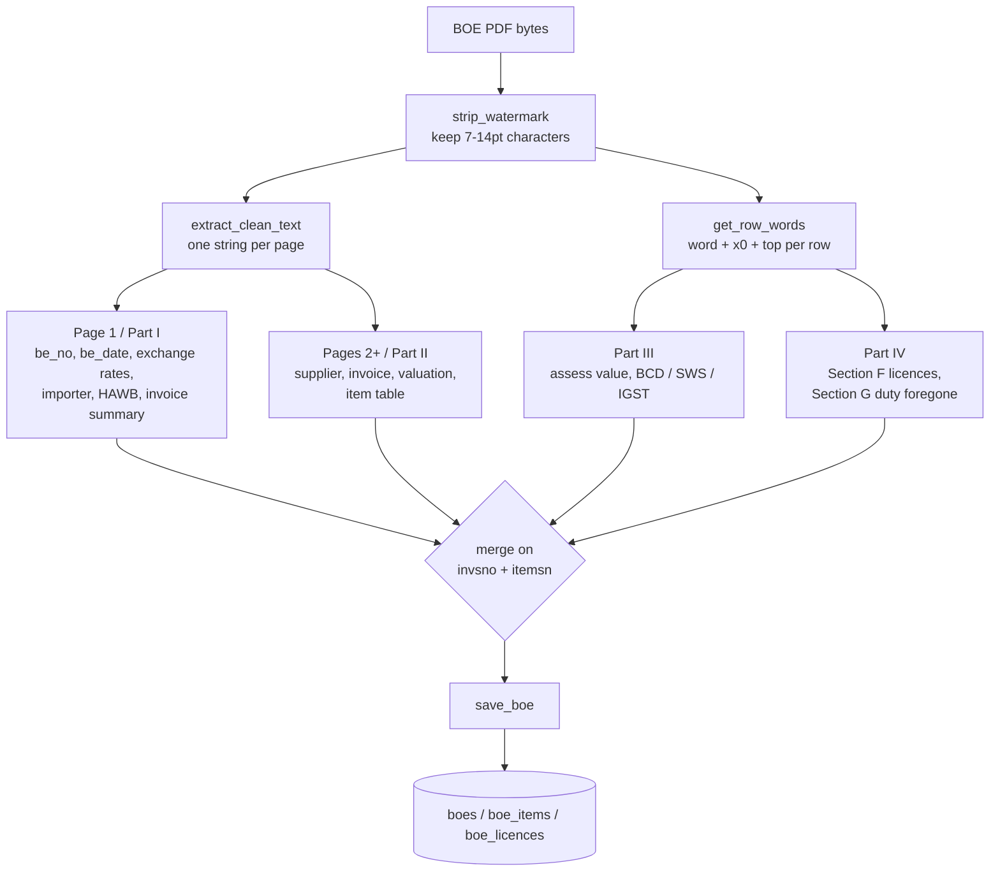
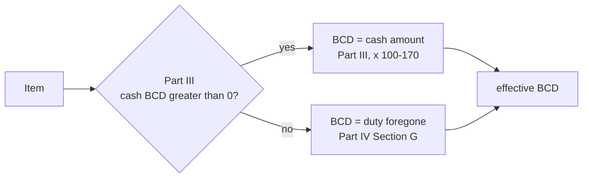
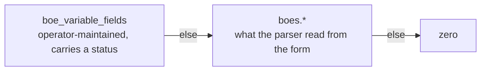

# BOE Costing Portal — Technical Whitepaper

The BOE Costing Portal is a web application that turns an ICEGATE Bill of
Entry into a structured import record, computes the landed cost of every line
item on it, and lets that costing be re-run under hypothetical inputs without
disturbing the record it came from.

It answers one question, repeatedly and exactly: **what did this item cost me,
landed, per piece?**

The output format is the C-SHEET workbook the business has always costed
against. What the portal changes is that nobody transcribes figures into it by
hand, and the arithmetic behind it is pinned by tests.

---

## 1. The system in one view

The portal is built as six modules. Each owns one part of the journey from a
government PDF to a defensible cost per piece, and each is described in its
own section below.



| # | Module | Owns | Status |
| --- | --- | --- | --- |
| 1 | **Access and identity** | who may open the portal at all | in development |
| 2 | **Import register** | the list of records, filtering, retrieval | live |
| 3 | **Ingestion** | PDF upload, extraction, document storage | live |
| 4 | **Costing engine** | the landed-cost model | live |
| 5 | **Simulation workbench** | scenarios and their comparison | live; per-scenario password in development |
| 6 | **Export** | the C-SHEET workbook, actual and simulated | live |

*Status is given once, here, so the rest of this document can describe the
system as a whole rather than annotating every paragraph.*

---

## 2. Architecture

Two deployable services and one database.



### 2.1 Why the work is split in two

The portal is TypeScript and cannot read a PDF. The extraction is positional —
`pdfplumber`, by x-coordinate — which is what lets it survive watermark bleed,
OCR spelling variants and multi-invoice numbering. Rewriting that in
TypeScript would mean re-deriving every one of those cases in a language with
no comparable PDF layout library.

So one Python process exists, and it is needed for exactly two actions:

| Action | Needs the parser service |
| --- | --- |
| PDF upload | yes |
| Excel download, actual and simulated | yes |
| Records list, filters, sorting | no |
| Costing, simulations, comparisons | no |

Everything else is Postgres reads plus arithmetic in the browser.

### 2.2 Two deployments, not one

The two services deploy as separate Vercel projects from the same repository.
A Next.js app and a Python function both claim `/api/*`, and inside a single
project Next answers first — requests never reach Python. The parser therefore
needs a project with **no framework**. A `vercel.json` at the repository root
is also applied to the portal whatever root directory it is configured with,
so `parser/` is entirely self-contained and nothing sits at the repository
root. Neither project can affect the other.

They are joined by one variable, `NEXT_PUBLIC_API_BASE_URL`, which can point
at localhost, a container, or a deployment; the portal does not care which.
`NEXT_PUBLIC_*` values are compiled in at build time, so changing one requires
a redeploy rather than a restart.

### 2.3 One source of truth for the model

`frontend/src/lib/costing.ts` is the single implementation of the costing
model. It is pure and dependency-free: no Supabase, no React, no clock. The
same inputs always give the same outputs, which is what makes it fully
unit-testable in isolation.

The simulation export does not redo the arithmetic server-side. The portal
posts the costing result it is already displaying and the parser service lays
it into the workbook template. Two implementations of one model, shown to the
same user from the same page, would eventually disagree; this way there is
only one.

---

## 3. Module 1 — Access and identity

Access is the first module because it is the gate every other module sits
behind. Nothing else in the system can make a distinction it does not make.

### 3.1 Sign-in

The portal is entered through Supabase Auth. Every page requires a session;
without one the request is redirected to sign-in. The anon key compiled into
the client bundle stops being a key to the data and becomes only the key that
lets a browser ask to sign in — the Postgres policies behind it grant to
*authenticated*, not to *anyone*.

This distinction is the whole point of the module. Data access is decided by
policies at the database, not by which screen the interface chooses to render,
so a route that forgets to check is not a way in.

### 3.2 What each credential can do

Three credentials exist, and they are deliberately unequal.

| Credential | Held by | Can |
| --- | --- | --- |
| **anon key** | the browser, in the client bundle | read the import tables for a signed-in session; write nothing |
| **service_role key** | the parser service only, server-side | read and write everything; bypasses RLS; never reaches a browser |
| **`PARSER_ADMIN_TOKEN`** | operators | the parser's administrative routes — record listing, retrieval, deletion, supporting-document upload |

Writes to the import tables are closed to the browser entirely. The parser
service performs them with the `service_role` key, which is why ingestion is
the only path that can create or change a Bill of Entry.

The administrative routes **fail closed**: with no token configured they
return 503 rather than opening, so an unset variable in a new environment
cannot quietly reopen the door.

### 3.3 Identity downstream

A session gives the rest of the system something it otherwise lacks — a person
to attribute an action to.

- **Scenarios acquire an owner.** `boe_scenarios` carries a `created_by`
  referencing the authenticated user, which is what makes a per-scenario
  password (§7.6) meaningful and what any future revision history will key on.
- **The parser's browser-facing routes verify a session.** Upload and the two
  Excel routes are reached from the browser; with a session they can check a
  token, leaving `PARSER_ADMIN_TOKEN` as a break-glass key rather than the
  only guard.
- **Excel download moves off a plain link.** An `<a href>` carries no
  Authorization header, so the export is fetched with the session attached, or
  issued as a short-lived signed URL.

---

## 4. Module 2 — Import register

The register is the front door: every Bill of Entry on file, in one list.

Records are fetched once per page load and filtered, sorted and paged in the
browser. For a few hundred records that is instant and avoids a round trip per
keystroke; `LIST_LIMIT` is the guard on that choice.

| Control | Behaviour |
| --- | --- |
| Supplier, BOE number | substring match, case-insensitive |
| Date range, value range | either end may be left open |
| Sorting | any column, ascending or descending; undated records sort last in both directions |
| Paging | ten rows per page, most recent first |

Filters combine, and the record count reads *n of m* whenever any is active,
so the amount of hidden data is always on screen.

Opening a record shows the shipment facts — supplier, invoice number and date,
BE date, AWB/HAWB, importer — the costing table, the licence rows, and the
indexed documents. Six headline tiles carry exchange rate, invoice value,
freight, expenses, duty in cost and average cost per piece.

**Provisional and confirmed figures are distinguished on sight.** Exchange
rate and freight are routinely estimated at costing time and settle weeks
later. Each carries a status, shown green when confirmed and red while still
provisional, and anything never marked confirmed counts as provisional:
silence is not confirmation. A system that stored only the latest value could
not make this distinction at all.

---

## 5. Module 3 — Ingestion

Ingestion converts a printed government form into rows.

An ICEGATE Bill of Entry is a fixed-layout form, typically 7–30 pages, printed
to PDF. It has no data layer — no XML, no embedded metadata. Every stored
field is recovered from the printed page.



Two reading strategies are used deliberately. Parts I and II print a label
beside each value, so a regex anchored on the label finds it. Parts III and IV
are dense grids where one row carries BCD, SWS and IGST as bare numbers under
column headers printed pages earlier — there, the x-coordinate is the only
thing that says which number is which.

Page furniture is removed before words are assembled rather than after. The
form sets its content between 7pt and 14pt; the diagonal *ASSESSED COPY*
watermark and the sideways section labels fall outside that band and fuse with
real tokens when they are not filtered out. Filtering by character size
removes them at source, so nothing downstream has to guess which letters are
real.

[`docs/PARSER.md`](PARSER.md) is the field-by-field reference for this module:
every field, where on the form it comes from, and the circumstances that
change the answer.

**Ingestion also owns the document store.** The uploaded PDF is written to a
private Storage bucket and indexed in `boe_documents`; the record page signs a
fresh link per render, expiring an hour later. Supporting documents — invoice,
packing list, certificate of origin — are extracted heuristically, so their
output is treated as a hint and the raw text is always retained.

Re-uploading a Bill of Entry replaces its items and licences wholesale rather
than duplicating them, and brings any field still marked provisional back in
line with the new parse. Fields confirmed by a person are never overwritten,
and every change is logged to `boe_field_history`.

---

## 6. Module 4 — Costing engine

Landed cost is **value-proportional apportionment of a single expense pool**.
For each item *i*:

```
declared INR     Fi  =  unit_price_usd  x  qty  x  exchange_rate
value share      si  =  Fi / SUM(F)
expense share    Hi  =  expense_pool  x  si
duty in cost     Gi  =  BCD + SWS
cost per piece   Ii  =  (Fi + Gi + Hi) / qty
selling price    Ji  =  Ii x (1 + margin%)
```

and, separately, a reconciliation of computed against assessed value:

```
assess computed  Oi  =  Fi + freight_i + misc_i + insurance_i
assess actual    Pi  =  boe_items.assess_value
difference       Qi  =  Oi - Pi
```

Change any expense and every item's slice moves in proportion. Change an
item's price and the shares are recomputed before the split.

### 6.1 The expense pool

The pool is the sum of every cost of getting the consignment onto the shelf:
freight, insurance, clearance, misc charges (freight 2), supplier freight,
bank charges, own bank charges, and others. All eight are apportioned.

Costings produced here read higher than the legacy spreadsheet on any
consignment where the last four are non-zero: the template captured and
displayed them but did not sum them into cost per piece. The Excel export
writes the corrected total, so workbook and screen agree, and the C-SHEET
formulas are evaluated by hand in `costing.test.ts` and checked against the
engine to keep them that way.

### 6.2 IGST is excluded from cost

IGST is a creditable input tax: it is recovered, so it is cash flow rather
than cost. Duty in cost is BCD plus SWS. IGST is reported separately as part
of the cyber-receipt outflow.

### 6.3 Cash BCD versus licence-paid BCD

An item's BCD may be paid in cash or met by debiting an export-incentive
licence, and the form records these in different places.



On a fully licence-paid Bill of Entry, page 1 shows **BCD 0** while SWS and
IGST are non-zero — SWS being 10% of a BCD never paid in cash. Section G is
then the only source of the real figure. A cross-check that holds on real
forms: Section G's per-item duty foregone equals the sum of that item's
Section F licence debits, and the total is exactly 10× the SWS on page 1.

### 6.4 Duty amounts, not duty rates

The Bill of Entry records duty *amounts*, never *rates*. Effective rates are
back-computed from what customs actually charged, which is what allows duty to
respond to a change in value in a simulation. Where an item has no assessable
value to back-compute from, the engine holds it at its actual duty and flags
it rather than multiplying by a zero rate and reporting nil duty.

### 6.5 Where an input comes from

An expense figure is resolved in a fixed order.



An operator-maintained value wins over what the parser read, which wins over
zero. This is why a corrected parse does not silently override a figure a
person has already confirmed.

---

## 7. Module 5 — Simulation workbench

A scenario is a saved what-if against one Bill of Entry.

### 7.1 Null means inherit

Every adjustable column on a scenario is nullable, and null means *inherit the
actual*. A new scenario reproduces the actual costing exactly until something
is deliberately changed, so any difference on screen is a difference the user
made. This is what makes a scenario diffable against the record rather than a
disconnected copy.

Per-item overrides are sparse for the same reason: a row exists only for an
item actually touched, null columns within it still inherit, and an override
carrying no change is discarded on save.

### 7.2 Scenario inputs

| Input | Behaviour |
| --- | --- |
| Duty mode | **fixed** holds duty at what customs charged; **float** recomputes it from the BOE's effective rates |
| Exchange rate | INR per USD, with a confirmed / provisional status |
| Freight | typed as a total, or computed as rate × weight, volume or containers; also status-carrying |
| Freight mode | Air / Sea / Road / Courier / Other — a label; it changes no figure |
| Expenses | insurance, clearance, misc, supplier freight, bank charges, own bank charges, others |
| Margin | drives the selling-price columns of the export |

A half-filled freight calculator never wins: a partially configured basis must
not silently zero out freight, and choosing a basis is not itself a freight
figure, so it must not drop the inherited actual either.

### 7.3 Per-item adjustment

Price and quantity may be overridden per item. An empty box shows the actual
as its placeholder, so an untouched row still reads as the number it will use.

**FOC items** keep their declared value in the apportionment base. The goods
still ship and are still assessed, so removing their value would shift freight
onto the paid items and overstate their cost. A separate toggle decides
whether duty applies.

**Duplicated items** are extra rows existing only in the scenario, carrying
their own description, price and quantity. They always derive duty from their
source's *rates*, even when duty is fixed: locking a copy to the source's
actual amounts would charge the same customs payment twice. Duplicating a copy
points at the same original, so the chain cannot go stale.

### 7.4 Keyed by (invsno, itemsn)

Scenario rows key on the natural key rather than a row id. Re-ingesting a Bill
of Entry deletes and reinserts its items wholesale, which would strand every
id-based reference. The natural key survives it, and it is the same key Parts
III and IV of the form use.

### 7.5 Comparison

Every scenario on a record is costed on every render, in the browser — pure
arithmetic over a few dozen rows, which is what makes the controls respond as
they are typed. The comparison strip shows the active scenario against the
actual, and a table lists the actual and every scenario side by side. Unsaved
edits are included in both, so a comparison always reflects what is on screen.

### 7.6 Scenario locking

A scenario may carry a password. Once it is set and the scenario saved,
opening that scenario — its inputs, its item adjustments, its costed rows —
requires the password; without it the scenario is listed by name and nothing
more is shown.

**Enforcement is at the data layer, not in the interface.** The portal reads
scenario tables directly from Postgres, so a lock that only hides a panel is a
curtain rather than a lock — the row is one query away, and it is a query the
client is otherwise entitled to make. The password is stored as an Argon2id
hash that is never selectable; verification runs as a `security definer`
function returning a short-lived grant, and the row-level policy releases the
scenario body only against that grant. The owner can clear the lock, so a
forgotten password costs a reset rather than the costing.

Three consequences follow from the rest of the design:

- **The lock is on the scenario, never on the record.** The actual costing
  must stay readable; the value of a scenario is being diffable against it,
  and locking the record would break the comparison for every scenario on that
  Bill of Entry, including unlocked ones.
- **The comparison table degrades honestly.** A locked scenario appears as a
  named row with its figures withheld — not omitted, which would misstate how
  many scenarios exist, and not costed-but-hidden, which would leak the answer
  through the comparison.
- **A password takes effect on save**, consistent with everything else in the
  workbench: what is on screen is what is being compared, saved or not.

A scenario password is a sharing control between people who are already signed
in. It is not a second factor and not a substitute for Module 1.

---

## 8. Module 6 — Export

Both exports produce the same C-SHEET workbook with live formulas, so a
recipient can trace any figure through the sheet rather than receiving a flat
dump.

A simulation exports through the same template, filled with the scenario's
figures, with a red banner naming the scenario so a what-if cannot be mistaken
for the actual record. Three inputs a scenario needs that an actual record
does not:

| Input | Purpose |
| --- | --- |
| `margin_pct` | column J, in place of the actual's fixed 102% |
| `other_charges` | `I8`, which an actual record has no field for |
| `foc_keys` | switches those rows to `=(G+H)/C`, dropping the goods value while leaving it in `F` so the row still absorbs freight and duty |

Duty foregone is deliberately not passed to the export. The engine has already
resolved each item's BCD to whichever of cash or licence applies, and letting
the workbook substitute a foregone amount for a zero BCD would overwrite duty
a scenario waived on purpose.

Row numbering is contiguous `1..n` in display order, because the C-SHEET reads
one sheet's row `10+i` from another's row `12+i`; a gap shifts every duty
reference below it.

---

## 9. Data model

| Table | Holds | Written by |
| --- | --- | --- |
| `boes` | one row per Bill of Entry, keyed by BE number | parser service |
| `boe_items` | line items, keyed `(be_no, invsno, itemsn)`, plus a document-wide `global_sno` | parser service |
| `boe_licences` | licence debits per item; reference only | parser service |
| `boe_documents` | index of the private Storage bucket | parser service |
| `boe_variable_fields` | the cost figures estimated at costing time, each with a provisional / confirmed status | parser service |
| `boe_field_history` | audit trail of changes to those figures | parser service |
| `boe_scenarios` | one saved what-if; every input nullable | portal |
| `boe_scenario_items` | sparse per-item overrides and added rows | portal |
| `document_extractions` | heuristic fields from supporting documents | parser service |

Migrations run in numeric order and every statement is `if not exists`, so
re-running one changes nothing.

Two constraints carry meaning rather than hygiene. Two scenarios on the same
record may not share a name, because the comparison identifies columns by name
and the same name twice is unreadable. And `global_sno` must be contiguous in
display order, for the workbook reason in §8.

A Bill of Entry carries IEC, GSTIN, supplier identities and unit prices, so
sample documents are kept out of version control.

---

## 10. Operations

### 10.1 Configuration

| Setting | Service | Purpose |
| --- | --- | --- |
| `SUPABASE_URL`, `SUPABASE_KEY` | parser | `service_role` credentials for writing |
| `NEXT_PUBLIC_SUPABASE_*` | portal | project URL and anon key |
| `NEXT_PUBLIC_API_BASE_URL` | portal | where the parser service answers |
| `ALLOWED_ORIGINS` | parser | which origins may call it |
| `PARSER_ADMIN_TOKEN` | parser | administrative routes; unset means closed |

Both services point at the same Supabase project.

### 10.2 Verification

Three independent checks, each catching a different class of error.

**The document reconciles against itself.** The form states its own assessable
value; the parser computes one independently as
`inv_value × exchange_rate + freight + insurance + misc`. The two agree to the
paisa on a correct parse, and a gap means an input is in the wrong unit — the
single most useful diagnostic in the system.

| BOE | Computed | Form states | Gap |
| --- | --- | --- | --- |
| 3168452 | 4,204,710.42 | 4,204,710.41 | +0.01 |
| 2898472 | 616,041.60 | 616,041.60 | 0.00 |

**Screen and workbook agree.** The C-SHEET formulas are evaluated by hand in
the test suite and checked against the engine.

**Invariants hold.** Switching duty mode with nothing else changed moves no
number; a new scenario reproduces the actual costing exactly. Both are tests,
not conventions.

`npm test` runs the engine tests and needs no database.

### 10.3 Deployment

| Component | Address | Runtime |
| --- | --- | --- |
| Portal | **https://boe-costing-portal.vercel.app** | Next.js 16 on Vercel |
| Parser service | https://boe-costing-portal-backend.vercel.app | FastAPI on Vercel |
| Database, auth, storage | Supabase, project `lqurlldfpesbjhrkkczv` | Postgres 17 |

Two Vercel projects from one repository: the portal with root directory
`frontend` and zero configuration, the parser with root directory `parser`,
framework **Other**, and its own `vercel.json`. Set the portal's API base URL
to the parser's address and the parser's allowed origins to the portal's.

They are two projects rather than one because a single project cannot serve
both a Next.js app and a Python function under one `/api` namespace: the
runtimes contend for the same routes, and the request reaches whichever the
platform resolves first.

Sign-in is Google OAuth through Supabase Auth, so the portal's callback
(`/auth/callback`) must appear in the Supabase redirect allowlist for **every**
origin it is served from — production and local alike. An origin that is
missing completes the whole round trip at Google and only then fails, on the
way back, which makes it look like a credentials problem rather than a
configuration one.

The parser also ships a Dockerfile and runs as a container anywhere, which is
the route to take when a Bill of Entry is large enough to press against a
serverless time limit.
